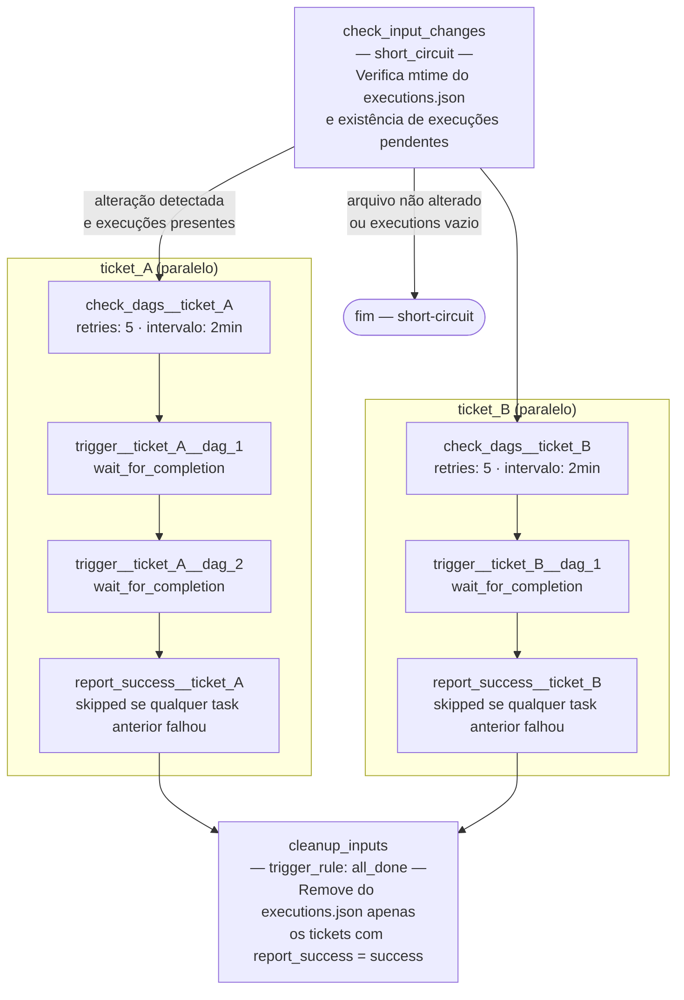

# Airflow — Atendimento de Chamados

Repositório para orquestração de chamados via Apache Airflow. A DAG `dynamic_trigger_control_dag` é responsável por detectar alterações no arquivo de inputs, verificar a disponibilidade das DAGs configuradas, executá-las conforme definido e remover do arquivo de inputs apenas as execuções concluídas com sucesso.

---

## Estrutura do repositório

```
.
├── dags/                        # DAGs do Airflow
│   ├── dynamic_trigger_control_dag.py          # DAG orquestradora principal
│   └── dag_study.py             # Exemplo de DAG de atendimento
├── inputs/
│   └── executions.json          # Arquivo de configuração de execuções
├── config/
│   └── airflow.cfg              # Configuração do Airflow
├── plugins/                     # Plugins customizados (se houver)
├── logs/                        # Logs de execução (não versionado)
├── docker-compose.yaml
└── .env                         # Variáveis de ambiente (não versionado)
```

---

## Pré-requisitos

- Docker e Docker Compose instalados
- Arquivo `.env` configurado na raiz (variáveis: `FERNET_KEY`, `AIRFLOW__API_AUTH__JWT_SECRET`, etc.)

Para subir o ambiente:

```bash
docker compose up -d
```

Acesse o Airflow em `http://localhost:8080` (usuário e senha padrão: `airflow` / `airflow`).

---

## Para o atendente de chamados

O atendente é responsável por registrar quais DAGs devem ser executadas para atender a um chamado, preenchendo o arquivo `inputs/executions.json`.

### Formato do arquivo de inputs

```json
{
    "executions": [
        {
            "ticket_id": "ATD-001",
            "dag_ids": [
                {
                    "dag_id": "nome_da_dag",
                    "inputs": {
                        "parametro_1": "valor_1",
                        "parametro_2": "valor_2"
                    }
                }
            ]
        }
    ]
}
```

| Campo | Descrição |
|---|---|
| `ticket_id` | Identificador único do chamado (ex: `ATD-001`) |
| `dag_ids` | Lista ordenada de DAGs a serem executadas para o chamado |
| `dag_id` | Nome da DAG cadastrada no Airflow |
| `inputs` | Parâmetros de entrada para a DAG (consulte o desenvolvedor responsável pela DAG) |

### Regras importantes

- **Apenas uma execução da `dynamic_trigger_control_dag` pode estar ativa por vez.** Se uma execução já estiver em andamento quando um novo agendamento ou trigger ocorrer, o novo disparo será ignorado.
- Cada entrada em `executions` representa um chamado independente. Chamados diferentes rodam **em paralelo**.
- As DAGs dentro de um mesmo chamado rodam **em sequência**, na ordem em que estão listadas.
- Se uma DAG da sequência falhar, as seguintes **não serão executadas**.
- Um chamado só é disparado se **todas** as suas DAGs estiverem disponíveis no Airflow. Caso contrário, a verificação retenta automaticamente até 5 vezes (com intervalo de 2 minutos) antes de falhar.
- Ao final do processamento, **apenas as execuções concluídas com sucesso são removidas do `executions.json`**. Chamados que falharam permanecem no arquivo para reprocessamento no próximo ciclo.

### Como registrar e disparar um chamado

1. Edite o arquivo `inputs/executions.json` adicionando a entrada correspondente ao chamado.
2. Salve o arquivo — a alteração será detectada automaticamente na próxima execução da `dynamic_trigger_control_dag` (agendada para 19h e 23h).
3. Para disparar imediatamente, acesse o Airflow em `http://localhost:8080`, localize a DAG `dynamic_trigger_control_dag` e execute-a manualmente.

> **Atenção:** não edite o arquivo `inputs/executions.json` enquanto a `dynamic_trigger_control_dag` estiver em execução. Ao final de cada ciclo, apenas os chamados bem-sucedidos são removidos; os demais permanecem para reprocessamento automático.

---

## Para o desenvolvedor de DAGs

O desenvolvedor é responsável por criar e manter as DAGs que viabilizam o atendimento dos chamados.

### Criando uma nova DAG de atendimento

1. Crie um novo arquivo `.py` em `dags/`.
2. Use o decorator `@dag` com `schedule=None` (execução apenas via trigger) e `catchup=False`.
3. Declare os parâmetros esperados via `params` no decorator `@dag` — esses valores correspondem ao `inputs` definido pelo atendente no arquivo de inputs.
4. Acesse os parâmetros dentro das tasks via `context["inputs"]`.

**Exemplo mínimo:**

```python
from airflow.sdk import dag, task
from datetime import datetime

@dag(
    dag_id="minha_dag",
    schedule=None,
    start_date=datetime(2026, 1, 1),
    catchup=False,
    params={
        "parametro_1": "valor_padrao",
    },
)
def minha_dag():

    @task
    def processar(**context):
        valor = context["params"]["parametro_1"]
        print(f"Processando com: {valor}")

    processar()

minha_dag()
```

5. Documente os parâmetros aceitos pela DAG para que o atendente saiba como preencher os `inputs` no arquivo de inputs.

### Fluxo da DAG `dynamic_trigger_control_dag`



**Descrição de cada task:**

| Task | Trigger rule | Descrição |
|---|---|---|
| `check_input_changes` | `all_success` (short_circuit) | Compara o `mtime` atual do `executions.json` com o valor persistido em `dynamic_trigger_control_dag_last_mtime`. Encerra toda a execução sem erro se o arquivo não foi alterado ou se não há execuções pendentes. |
| `check_dags__<ticket>` | `all_success` | Verifica se todas as DAGs do ticket estão registradas no DagBag. Retenta até 5 vezes (intervalo de 2 min) antes de falhar. Uma instância por ticket, todas rodam em paralelo. |
| `trigger__<ticket>__<dag>` | `all_success` | Dispara a DAG alvo via `TriggerDagRunOperator` e aguarda sua conclusão (`wait_for_completion=True`). As DAGs de um mesmo ticket rodam em sequência; se uma falhar, as seguintes são ignoradas. |
| `report_success__<ticket>` | `all_success` (padrão) | Marcador lógico de conclusão bem-sucedida do ticket. Fica como `skipped` se qualquer task anterior do ticket falhou ou foi ignorada. |
| `cleanup_inputs` | `all_done` | Inspeciona o estado das tasks `report_success__*` do run atual e remove do `executions.json` apenas os tickets cujo `report_success` foi `success`. Tickets com falha permanecem para reprocessamento. |

**Notas gerais:**

- Apenas uma execução da `dynamic_trigger_control_dag` pode estar ativa por vez (`max_active_runs=1`).
- Tickets diferentes são processados **em paralelo**; as DAGs dentro de cada ticket rodam **em sequência**.
- A DAG é agendada para rodar às **19h e 23h** diariamente, mas pode ser disparada manualmente a qualquer momento.
- O controle de alterações é baseado no `mtime` do `executions.json`, persistido em `inputs/dynamic_trigger_control_dag_last_mtime` (não versionado). Esse arquivo sobrevive a reinicializações do container.

### Boas práticas

- Prefira `schedule=None` em DAGs de atendimento — elas devem ser disparadas exclusivamente pela `dynamic_trigger_control_dag`.
- Valide os `params` no início da primeira task para falhar rapidamente com mensagem clara caso o `inputs` esteja incompleto.
- Mantenha o `dag_id` estável — renomear uma DAG em uso pode quebrar chamados em andamento.

---

## Melhorias futuras

### Confiabilidade e observabilidade

- **Notificações de falha**: integrar callbacks `on_failure_callback` nas tasks críticas (`check_dags_in_dagbag`, `trigger__*`) para envio de alertas via e-mail, Slack ou outro canal, informando o `ticket_id` e o motivo da falha.
- **Registro de histórico de execuções**: persistir em um arquivo ou banco de dados o resultado de cada execução (ticket, DAGs disparadas, status, timestamps), evitando perda de rastreabilidade após a limpeza do `executions.json`.
- **Timeout configurável por ticket**: permitir definir `execution_timeout` individualmente por entrada no `executions.json`, em vez de um valor fixo para todas as DAGs.

### Segurança e integridade

- **Validação do schema do `executions.json`**: validar o arquivo de inputs contra um schema JSON (ex: com `jsonschema`) logo na task `check_input_changes`, rejeitando entradas malformadas antes de iniciar qualquer execução.
- **Controle de duplicidade de `ticket_id`**: detectar e rejeitar entradas com `ticket_id` duplicado no arquivo de inputs, evitando execuções ambíguas.
- **Backup do `executions.json` antes da limpeza**: salvar uma cópia com timestamp do arquivo antes de zerá-lo na task `cleanup_inputs`, preservando o histórico de chamados submetidos.

### Escalabilidade e manutenibilidade

- **Grafo dinâmico via banco de dados**: substituir a leitura do `executions.json` em parse-time por uma fonte de dados persistente (ex: tabela no banco do Airflow ou uma variável do Airflow), eliminando a necessidade de reiniciar o scheduler para que novos chamados sejam refletidos no grafo.
- **Interface de submissão de chamados**: criar um script CLI ou formulário web simples para preencher e validar o `executions.json`, reduzindo erros manuais no preenchimento.
- **Testes automatizados das DAGs**: adicionar testes unitários com `pytest` para validar a estrutura das DAGs (ex: usando `DagBag` para checar ausência de erros de importação) e testes de integração para os fluxos principais.
- **Suporte a múltiplos ambientes**: parametrizar o `docker-compose.yaml` e as DAGs para suportar ambientes distintos (desenvolvimento, homologação, produção) via variáveis de ambiente ou perfis do Docker Compose.
